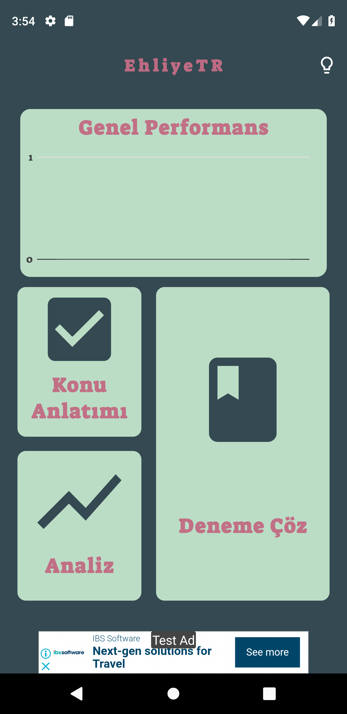
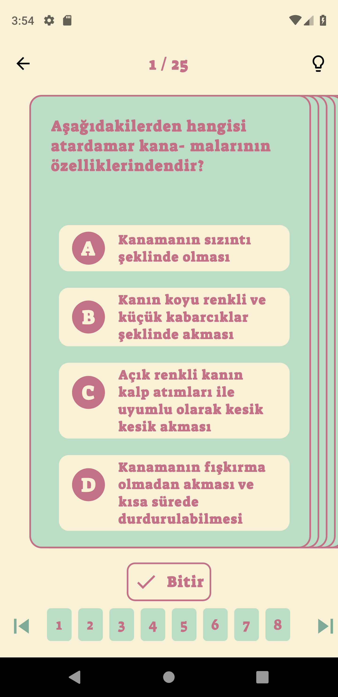
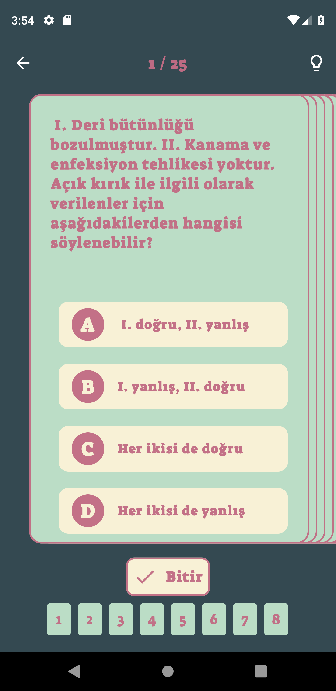

# EhliyeTR
Quiz app for studying Turkish driver license exam.

  </img>
  </img>
  </img>

## Dependencies Used
<ul>
    <li><a href="https://pub.dev/packages/provider">Provider</a></li>
    <li><a href="https://pub.dev/packages/sqflite">Sqflite</a></li>
    <li><a href="https://pub.dev/packages/charts_flutter">charts_flutter</a></li>
    <li><a href="https://pub.dev/packages/firebase_admob">firebase_admob</a></li>
</ul>
